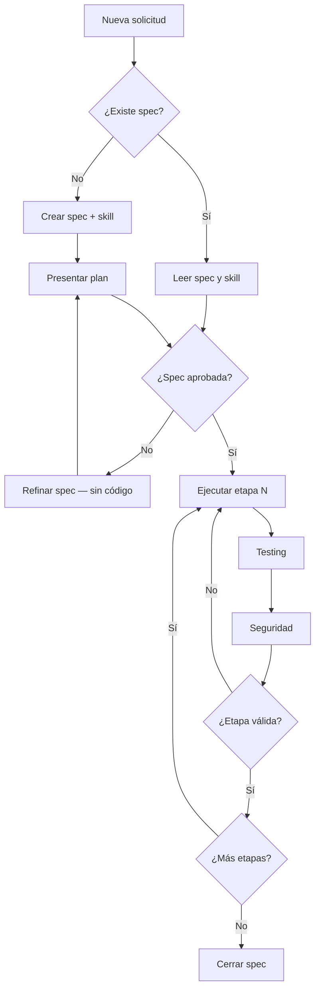

# Spec 000 — Framework Spec-as-Source

> **Estado:** Aprobado  
> **Tipo:** Meta-framework (orquestación IA)  
> **Última actualización:** 2026-06-05

---

## Objetivo

Establecer una capa de orquestación basada en inteligencia artificial que separe la planificación (`spec/`) y la ejecución guiada (`skill/`) del código de la aplicación (`app/`), garantizando que todo desarrollo futuro siga un flujo controlado: planificar → validar → implementar por etapas → probar → auditar seguridad.

## Alcance

### Incluido

- Estructura de directorios `spec/`, `skill/` y `app/`
- Plantilla estándar para nuevas especificaciones
- Skill maestra de orquestación para el agente de IA
- Checklists de testing y seguridad como capas transversales
- Convenciones de nomenclatura y flujo de trabajo

### Excluido

- Implementación de funcionalidades de aplicación (aún no definidas)
- Acoplamiento de `spec/` o `skill/` al framework o tecnología de `app/`
- Configuración de CI/CD (se definirá por solicitud)

## Arquitectura de capas

```
The-grup/
├── spec/          # Planes detallados (fuente de verdad para IA)
├── skill/         # Instrucciones de ejecución para el agente
└── app/           # Aplicación final (lógica de negocio)
```

| Capa | Responsabilidad | Restricción |
|------|-----------------|-------------|
| `spec/` | Qué, por qué, alcance, riesgos | No contiene código de aplicación |
| `skill/` | Cómo ejecutar el plan por etapas | No importa ni referencia módulos de `app/` |
| `app/` | Implementación técnica | Solo se modifica tras spec aprobado |

## Pasos de implementación

### Etapa 1 — Estructura base (esta spec)

- [x] Crear directorios `spec/`, `skill/`, `app/`
- [x] Redactar spec 000 (este documento)
- [x] Crear plantilla `_template.md` en `spec/`
- [x] Crear skill maestra en `skill/spec-as-source/`
- [x] Crear checklists de testing y seguridad
- [x] Inicializar `app/` con README de convenciones

### Etapa 2 — Por cada nueva solicitud del usuario

1. **Análisis (sin código):** Leer contexto del proyecto, specs existentes y estado de `app/`
2. **Planificación:** Crear `spec/NNN-<nombre-descriptivo>.md` usando la plantilla
3. **Skill específica:** Crear `skill/<nombre-tarea>/SKILL.md` derivada del plan
4. **Revisión:** Presentar plan al usuario; no implementar hasta confirmación implícita o explícita
5. **Ejecución por etapas:** Una etapa del plan a la vez, con validación entre etapas
6. **Testing:** Aplicar checklist antes de cerrar cada etapa
7. **Seguridad:** Aplicar checklist antes de cerrar cada etapa
8. **Cierre:** Actualizar estado de la spec a `Completado` o `Cancelado`

### Etapa 3 — Convenciones de numeración

- Specs: `NNN-nombre-kebab-case.md` (ej. `001-auth-login.md`)
- Skills: carpeta `skill/<nombre-tarea>/` con `SKILL.md`
- Una spec puede tener una o más skills asociadas

## Flujo obligatorio del agente



## Capa de testing

Definida en `skill/spec-as-source/testing-checklist.md`. Reglas:

- Cada etapa del plan debe declarar pruebas unitarias y funcionales esperadas
- No avanzar de etapa si las pruebas definidas fallan
- Las pruebas viven en `app/` (o subcarpeta acordada), nunca en `spec/` ni `skill/`

## Capa de seguridad

Definida en `skill/spec-as-source/security-checklist.md`. Reglas:

- Checklist obligatorio al final de cada etapa
- Vulnerabilidades detectadas se documentan en la spec antes de corregirse
- Secretos y credenciales nunca en `spec/`, `skill/` ni commits

## Riesgos y supuestos

### Riesgos

| Riesgo | Impacto | Mitigación |
|--------|---------|------------|
| Agente implementa sin leer spec | Alto | Skill prohíbe código antes de leer spec |
| Spec desactualizada respecto a `app/` | Medio | Actualizar spec al cerrar cada etapa |
| Sobre-ingeniería en capa de orquestación | Medio | Specs concisas; skills bajo 500 líneas |
| Acoplamiento spec ↔ tecnología | Alto | Specs en lenguaje de negocio, no de framework |

### Supuestos

- El usuario aportará solicitudes concretas tras este framework
- El agente tiene acceso a leer `spec/` y `skill/` al inicio de cada tarea
- `app/` puede usar cualquier stack; la orquestación es agnóstica
- Las respuestas al usuario se redactan en español

## Norte del proyecto

**The-grup** es un proyecto de clase de desarrollo de software. El norte es construir sistemas de forma disciplinada, con trazabilidad entre requisito → plan → implementación → validación, usando la IA como ejecutor controlado y no como generador improvisado de código.

## Criterios de aceptación de esta spec

- [x] Existen `spec/`, `skill/` y `app/` en la raíz
- [x] Existe plantilla reutilizable para nuevas specs
- [x] Existe skill maestra con flujo de no-programar-inmediatamente
- [x] Existen checklists de testing y seguridad
- [x] `app/` permanece vacío de lógica hasta la primera solicitud funcional
